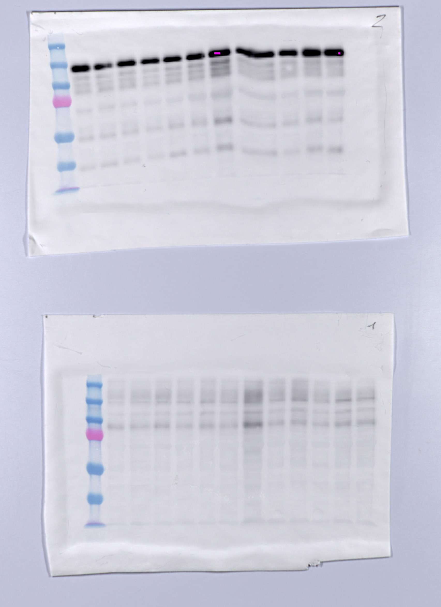

```{r setup, include=FALSE}
knitr::opts_chunk$set(echo = FALSE)
```

## This is sadly using ioslides as I cannot get the pdf to work.

<center>  <center> 

## Slide with incremental bullet points.

- Bullet 1
- Bullet 2
- Bullet 3

## Slide with simulataneous bullet points.

>- first simultaneous bullet point
>- second simultaneous bullet point
>- third simultaneous bullet point

## Slide with text in alternating colors.

>- This is in <span style="color:black">black</span>
>- <span style="color:red">Now all of the text is in red</span>
>- Why not change<span style="color:blue">some of the text to blue</span>
>-  back to the original color 


## Two images

<top>  <top>
<down>  <down>

## Two images with captions

## Two images with overlaid captions

```{r fig.width=4, fig.height=10,echo=FALSE}
##library(png)
##library(grid)
##img <- readPNG(value)
## grid.raster(img)
```
\begin{picture}(320,250)
\put(85,75){\includegraphics[height=6cm] 
{Owen.jpg}}
\put(00,60){\begin{minipage}[t]{1\linewidth}
{Choose a point on the unit circle. Connect it to  the origin with a line of length one, and denote the angle between that line and the horizontal coordinate axis by $\theta$.}
\end{minipage}}
\end{picture}