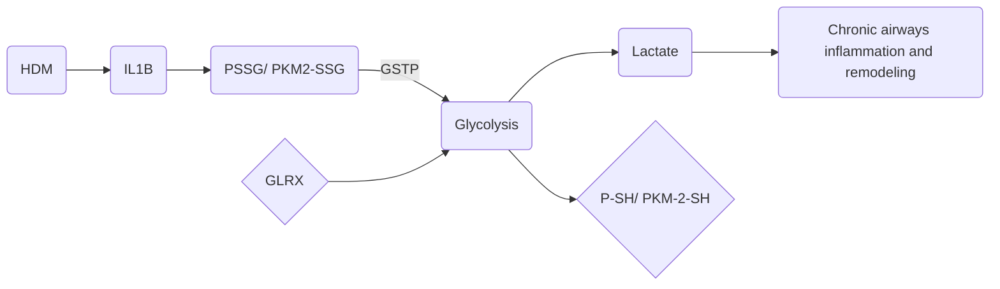
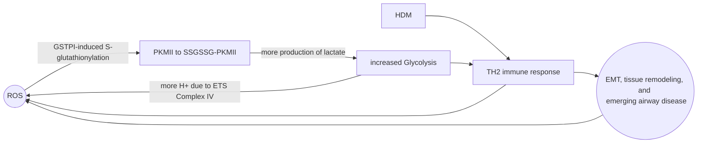
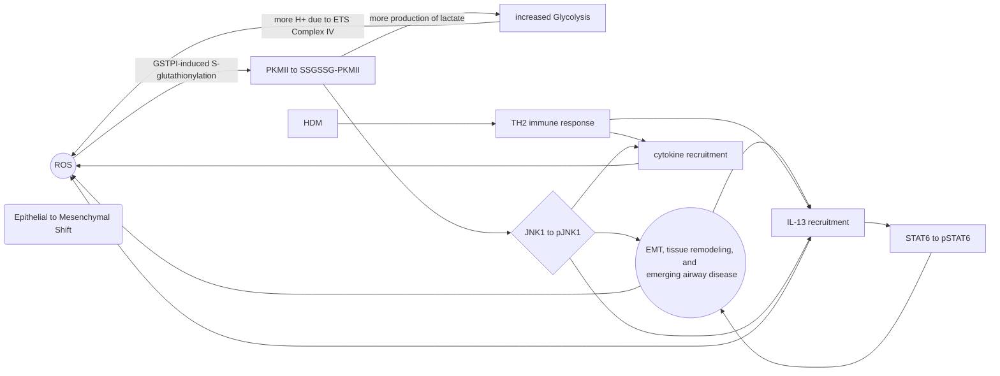

**Note**: all of these were done in Typora using mermaid. Soon I will be converting these and developing them 

**Figure 1**:A model of allergen-induced asthma that was proposed by my lab in a paper

**Figure 2**: Model of feedback loop via redox biology resulting in emerging airway disease- a slightly more involved working model that I am working on. I did this model before finding the one above so it is be no means complete and is most definitely a work in progress. It is focused on showing the feedback loop that is present.

**Figure 3**: Early proposed addition to model: the significance of JNK1.

